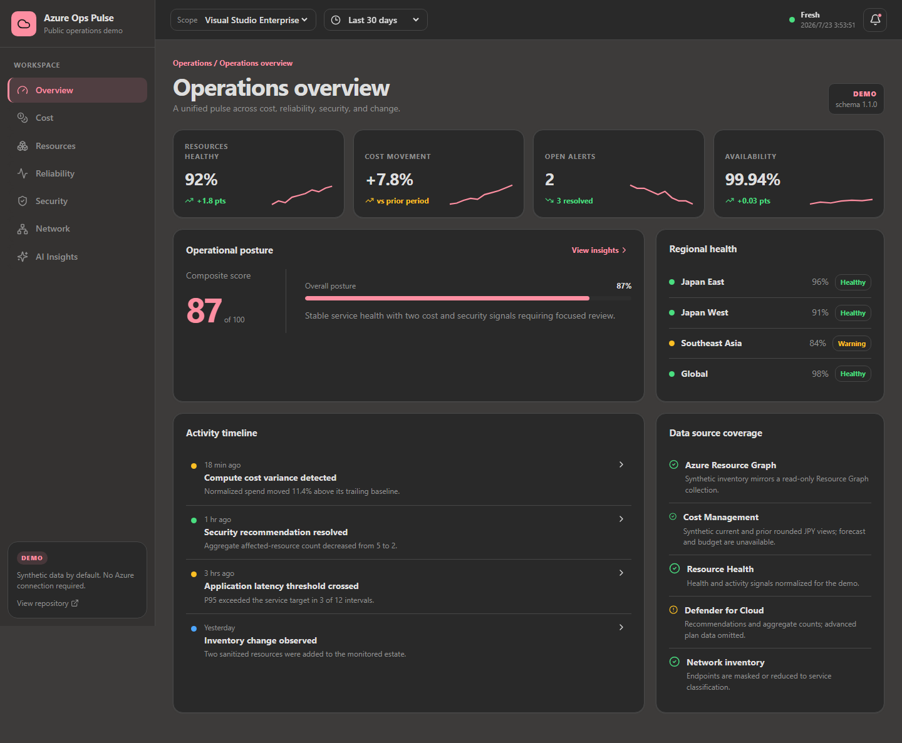
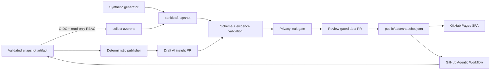

# Azure Ops Pulse

A polished, public-safe Azure operations dashboard demo built with React 19, TypeScript, and Vite.
It works immediately with realistic synthetic data and can optionally collect a read-only Azure
snapshot through GitHub Actions OIDC.

**Live site:** `https://aktsmm.github.io/azure-ops-pulse-demo/`

> **DEMO by default.** The committed snapshot is synthetic. Connecting Azure is an explicit
> repository-owner action, and collection failures never replace the last-known-good public data.

## Dashboard

- Seven responsive pages: Overview, Cost, Resources, Reliability, Security, Network, and AI
  Insights
- Dense navigation, scope/time controls, KPI sparklines, bento panels, event timeline, filters,
  accessible tables, contextual detail drawer, and explicit loading/empty/error states
- Warm off-white / charcoal Clawpilot theme with a deep rose accent and `scoutTheme` query support
- Hash routing and a Vite base of `/azure-ops-pulse-demo/` for reliable GitHub Pages navigation
- Visible snapshot mode, schema version, generation time, source coverage, and dynamic stale state



## Architecture



The collector holds raw Azure responses in process memory only. `sanitizeSnapshot` is the single
publication boundary. The workflow writes a candidate outside `public/`, validates it, scans it,
and only then copies it into the ephemeral checkout for a pull request.

## Run locally

Requirements: Node.js 22 and npm 10 or later.

```bash
npm ci
npm run generate:demo
npm run dev
```

Quality gates:

```bash
npm run lint
npm run typecheck
npm test
npm run validate:data
npm run build
```

The production build is emitted to `dist/`. `npm run build` also scans the complete Pages artifact
for full GUIDs, email addresses, unmasked IPv4 addresses, full IPv6 addresses, private keys, cloud
access keys, and suspicious secret assignments. All
syntactically valid IPv4 ranges, including RFC1918 and loopback addresses, are rejected.

## Public data contract and privacy boundary

Versioned JSON Schemas are under [`schemas/public/v1`](schemas/public/v1), with matching TypeScript
contracts in [`src/data/contracts.ts`](src/data/contracts.ts).

| Data | Public representation |
| --- | --- |
| Subscription / tenant GUID | Exactly the first 8 and last 8 hex characters remain; the middle 16 are masked while GUID grouping is retained |
| Resource group / resource name | First and last 25% plus a stable short hash; names of 8 characters or fewer become typed aliases |
| IPv4 / IPv6 | Last two IPv4 octets are masked; IPv6 retains only the first two hextets |
| URL / FQDN | Service/provider classification only; no usable endpoint |
| User / email | Fully replaced with a deterministic identity alias |
| Tags | Only `environment`, `team`, `workload`, and `criticality`; unknown values are aliased |
| Defender | Recommendation title and aggregate counts only; no asset, exploit, or vulnerability detail |
| Cost | Percentage changes and rounded approximate JPY labels only; forecast and budget are explicitly unavailable unless independently collected |
| Network | Resource inventory is separate from flow telemetry; inventory never implies a healthy connection |

Raw Azure responses, IDs, names, addresses, exact costs, tokens, and secrets must never be committed,
uploaded as artifacts, printed to logs, or passed to the AI workflow. Unit tests cover each
sanitization rule. The deterministic privacy scanner gates CI, Pages, Azure candidates, and AI
candidate changes.

## Azure collection setup

The standard workflow is [`.github/workflows/collect-azure.yml`](.github/workflows/collect-azure.yml).
It runs every **Tuesday and Friday at 06:00 Asia/Tokyo** (`0 21 * * 1,4` UTC) and on manual dispatch.

Create these GitHub Actions secrets:

| Secret | Purpose |
| --- | --- |
| `AZURE_CLIENT_ID` | Microsoft Entra application or user-assigned managed identity client ID |
| `AZURE_TENANT_ID` | Directory tenant ID |
| `AZURE_SUBSCRIPTION_ID` | Target subscription ID; never hard-coded |

The intended display subscription is **Visual Studio Enterprise**, but no subscription identifier is
stored in the repository.

1. Create a Microsoft Entra application or user-assigned managed identity.
2. Add a federated identity credential for this repository and the `main` branch. If an environment
   is added later, update the federated subject accordingly.
3. Assign only the read roles needed for enabled sources. Start with **Reader** on the target
   subscription, **Cost Management Reader** for cost data, and the minimum Defender for Cloud read
   role approved by your organization.
4. Add the three secrets above.
5. Run **Collect Azure snapshot** manually and review the generated data pull request.

The collector reads Azure Resource Graph `Resources`, `HealthResources`, and `SecurityResources`;
Cost Management Query; Activity Log; Resource/Service Health; Defender assessments,
subassessment counts, secure score controls, active-alert counts, regulatory-compliance aggregates;
and network inventory with supported Azure Monitor metric series. Cost queries cover the current
30-day period and the preceding comparable 30-day period separately, and all rows are summed before
the display category limit is applied. Signed credits remain in the net total; service-mix shares use
absolute contribution magnitude so refunds cannot produce negative or over-100% bars. Forecast and
budget values are not inferred from current spend; the bundled DEMO snapshot also marks them
unavailable. Network inventory is published independently while flow telemetry is marked unavailable.
APIs, metrics, or Defender plans that are unavailable are marked `partial` or `unavailable` in the
snapshot. A failed core inventory query exits without opening a PR or changing published data.

No Azure resources are created or remediated.

## GitHub Agentic Workflow

The source is [`.github/workflows/ai-insights.md`](.github/workflows/ai-insights.md); the generated,
SHA-pinned workflow is `ai-insights.lock.yml`. It was initialized and compiled with `gh aw` using
strict mode.

```bash
npm run compile:ai-insights
gh aw validate ai-insights --strict --no-check-update
gh aw lint .github/workflows/ai-insights.lock.yml
```

The agent:

- receives only `public/data/snapshot.json`;
- has read-only repository permissions;
- must use existing numeric evidence and bounded language;
- cannot call Azure or perform remediation;
- may change only the `aiInsights` field in the one allowlisted file;
- is followed by deterministic schema, exact numeric evidence, baseline-diff, and privacy checks;
- has every public safe output disabled; and
- can only hand off the already-sanitized snapshot through a one-day run artifact.

[`publish-ai-insights.yml`](.github/workflows/publish-ai-insights.yml) runs only after a successful
default-branch agent run. Its read-only validation job starts from a fresh default-branch checkout,
installs trusted dependencies from scratch, downloads only the candidate JSON, and repeats every
deterministic gate. It then emits a one-day trusted artifact. A separate publication job receives
write permissions only after validation succeeds and may open a **draft pull request** for human
review. The compiled agent workflow has no issue, discussion, comment, pull-request, or persistent
asset output permission. gh-aw v0.82.9 requires a safe-output processor and unified diagnostics
artifact in its raw generated lock, so `npm run compile:ai-insights` deterministically removes those
compiler-mandatory runtime blocks after strict compilation. CI asserts that the committed lock has
no public mutation handler and retains no unvalidated agent output.

`gh aw audit` requires a real GitHub Actions run ID or URL, so it is used after the first configured
run:

```bash
gh aw audit <run-id-or-url> --parse
```

GitHub Agentic Workflows is a public-preview capability. Repository owners must configure the
Copilot engine secret/access required by the installed `gh-aw` version and accept preview terms.
Automated merging is intentionally disabled: generated public data requires review, and Pages
validates the merged snapshot again before deployment.

## GitHub Pages and CI

- `ci.yml`: lint, typecheck, tests, public-schema validation, build, and privacy scan
- `pages.yml`: official Pages configure/upload/deploy actions with the `github-pages` environment,
  least permissions, base-path verification, and a final artifact privacy gate
- `collect-azure.yml`: OIDC collection into a review-gated data PR
- `ai-insights.md` / `.lock.yml`: read-only evidence analysis into a validated artifact
- `publish-ai-insights.yml`: trusted artifact revalidation into a draft data PR

All referenced GitHub Actions, including `azure/login`, are pinned to immutable commit SHAs. The
comments retain their source major version for Dependabot and review readability.

To publish:

1. In repository **Settings → Pages**, select **GitHub Actions** as the source.
2. Ensure workflows can create pull requests if Azure collection or agentic insight PRs are desired.
3. Merge a green pull request to `main`; the Pages workflow deploys the validated `dist/` artifact.

## Limitations

- The public view is intentionally lossy and cannot replace Azure Portal, Cost Management, Resource
  Health, Defender for Cloud, or private observability systems.
- Exact cost, endpoint, identity, vulnerability, and asset-level investigation stays in Azure.
- Cost forecast, budget utilization, and flow health remain unavailable unless their authoritative
  APIs or telemetry are independently collected; the dashboard never fabricates them from inventory.
- Availability varies by provider registration, subscription type, Defender plan, billing scope,
  retention, and assigned RBAC.
- The static site reflects the last approved snapshot. It marks data stale after 72 hours in the UI.
- Agent output is advisory. It cannot establish unsupported root cause or take Azure action.

## Official references

- Azure Login with OIDC:
  <https://learn.microsoft.com/azure/developer/github/connect-from-azure-openid-connect>
- Azure Resource Graph CLI:
  <https://learn.microsoft.com/azure/governance/resource-graph/first-query-azurecli>
- Cost Management Query REST API:
  <https://learn.microsoft.com/rest/api/cost-management/query/usage?view=rest-cost-management-2025-03-01>
- Azure network monitoring and observability:
  <https://learn.microsoft.com/azure/networking/network-monitoring-overview>
- Defender for Cloud Resource Graph samples:
  <https://learn.microsoft.com/azure/defender-for-cloud/resource-graph-samples>
- GitHub Pages custom workflows:
  <https://docs.github.com/pages/getting-started-with-github-pages/using-custom-workflows-with-github-pages>
- GitHub Agentic Workflows:
  <https://github.github.com/gh-aw/>
- Agentic Workflow security architecture:
  <https://github.github.com/gh-aw/introduction/architecture/>

## License

[MIT](LICENSE)
