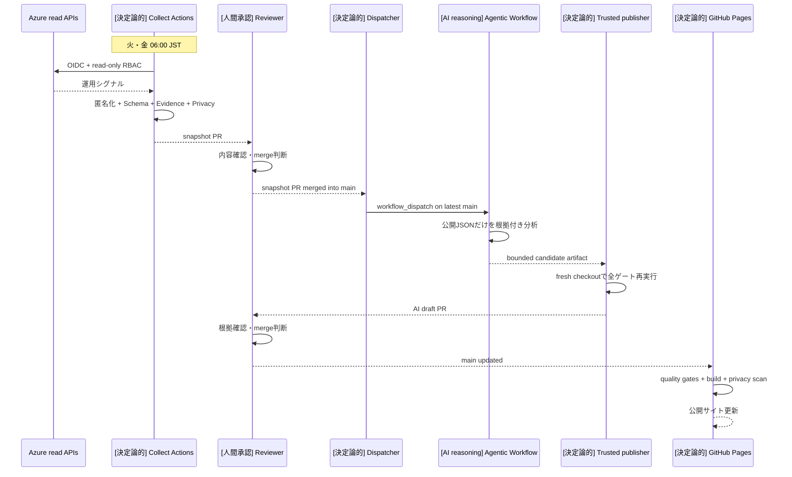

# Azure運用を、GitHub ActionsとAgentic Workflowsで自動化するデモ

Azure Ops Pulse は、Azure の公開可能な運用情報を **GitHub Actions で定期収集**し、
**GitHub Agentic Workflows で根拠付き分析**を作り、**人間のレビューを通してから
GitHub Pages へ公開**する一連の流れを示す公開デモです。

**ライブサイト:** <https://aktsmm.github.io/azure-ops-pulse-demo/>


## 対象読者・課題・得られる価値

| 対象 | よくある課題 | このデモで確認できること |
| --- | --- | --- |
| Azure 運用担当 | Portal の確認と共有資料作成が分断される | 読み取り専用収集から公開用スナップショット作成までの自動化 |
| セキュリティ・ガバナンス担当 | AI に渡るデータと権限が見えにくい | 匿名化、Schema、Privacy、根拠、権限分離の各ゲート |
| 意思決定者 | 数値の出所と更新経路を短時間で把握しにくい | 7画面の公開ビューと、PR履歴で追跡できる更新プロセス |
| GitHub / Platform 担当 | 決定論的 CI と AI reasoning の境界を設計したい | Actions、Agentic Workflow、人間承認、Pages の責務分離 |

このサイトは Azure Portal の代替ではありません。公開可能な集計値だけを扱い、
「何が分かるか」と同時に「何が未収集か」も表示します。

## 何が自動か

| 工程 | 実行主体 | 現在の動作 | 公開前の境界 |
| --- | --- | --- | --- |
| Azure 収集 | GitHub Actions | 火・金 06:00（JST）と手動実行 | OIDC、読み取り専用 RBAC |
| 匿名化 | 決定論的 TypeScript | 収集プロセス内で公開表現へ変換 | 生の応答は保存・artifact化しない |
| Validation | 決定論的 TypeScript | JSON Schema、runtime schema、evidence、privacy を検証 | 失敗時は候補を公開領域へ昇格しない |
| snapshot PR | GitHub Actions | 検証済み差分がある場合だけ作成 | **人間が内容を確認して merge** |
| AI 分析 | GitHub Agentic Workflow | snapshot PR の merge 後に最新 `main` で起動 | 入力は `public/data/snapshot.json` だけ |
| AI draft PR | trusted publisher | AI候補を再検証し、差分があれば draft PR を作成 | **人間が根拠と差分を確認して merge** |
| Pages deploy | GitHub Actions | `main` 更新後に build・検証・deploy | GitHub Pages environment |

**完全無人公開ではありません。** 収集、匿名化、検証、AI分析、PR作成、merge後の
Pages 配信は自動ですが、snapshot PR と AI draft PR の merge 判断は人が行います。

## イベント駆動の更新シーケンス



従来の 06:45 JST 独立 schedule はありません。snapshot が45分以内に merge されなくても、
古いデータを分析しないように、[`dispatch-ai-insights.yml`](.github/workflows/dispatch-ai-insights.yml)
が snapshot PR の `closed` イベントを検査します。`merged=true`、base=`main`、同一repository、
head=`automation/azure-snapshot-*`、既知titleのすべてが一致した場合だけ、固定名の
`ai-insights.lock.yml` を `workflow_dispatch` します。通常PR、未merge PR、fork PR、
AI PR では起動しないためループしません。

GitHub 公式仕様では、`GITHUB_TOKEN` が発生させる多くのイベントは再帰実行を抑止しますが、
`workflow_dispatch` と `repository_dispatch` は例外として実行されます。このデモは
dispatcher だけに `actions: write` を付与し、Agentic Workflow の権限は広げません。

## GitHub Actions workflow の役割

| Workflow | 役割 | 主な権限 |
| --- | --- | --- |
| [`collect-azure.yml`](.github/workflows/collect-azure.yml) | OIDC収集、匿名化候補の検証、snapshot PR作成 | `id-token: write`、`contents/pull-requests: write` |
| [`dispatch-ai-insights.yml`](.github/workflows/dispatch-ai-insights.yml) | 承認merge済み snapshot PR だけを判定してAIをdispatch | `actions: write`、`contents/pull-requests: read` |
| [`ai-insights.md`](.github/workflows/ai-insights.md) / `.lock.yml` | 公開JSONだけを読む根拠付き分析 | `contents: read`、`copilot-requests: write` |
| [`publish-ai-insights.yml`](.github/workflows/publish-ai-insights.yml) | fresh checkoutで候補を再検証しAI draft PR作成 | validateはread-only、publish jobだけwrite |
| [`ci.yml`](.github/workflows/ci.yml) | lint、typecheck、tests、schema、build、privacy | `contents: read` |
| [`pages.yml`](.github/workflows/pages.yml) | 検証済みproduction buildをPagesへdeploy | `pages/id-token: write` |

すべての参照 Action は immutable SHA に固定しています。

## Agentic Workflow とは

GitHub Agentic Workflows（gh-aw）は、Markdown の宣言と指示から、AI coding agent を
GitHub Actions 上で実行する hardened `.lock.yml` を生成する仕組みです。このリポジトリは
`gh-aw v0.82.14` を固定し、strict compile と検証を行います。gh-aw は Public Preview
として扱い、仕様変更を前提に固定versionと生成差分をレビューします。

### AI に渡す唯一の入力

`public/data/snapshot.json` だけです。Azure、workflow secrets、logs、他artifact、
commit history、外部サービスは分析対象にしません。入力はすでに公開用匿名化境界を通過しています。

### AI ができること / できないこと

| できること | できないこと |
| --- | --- |
| 既存の数値とsource pathを使った0〜4件の日本語分析候補 | Azure APIやsecretへの接続 |
| 相関と確認事項を、限定表現で提示 | 未収集値、root cause、識別子、正確な金額の捏造 |
| `aiInsights` 配列だけを変更 | Azure remediation、auto-merge、Pagesへの直接公開 |

### safe / trusted publisher 境界

Agent job は repository write 権限を持ちません。候補は1日保持・1MiB以下・単一の
`snapshot.json` artifact に限定されます。別workflowの trusted publisher が最新
default branchをfresh checkoutし、JSON Schema、runtime schema、日本語、数値根拠、
baseline差分、privacyを再検証します。write権限は検証後のPR作成jobだけにあります。

人間レビューを残す理由は、構造検証が通っても、運用上の優先度、説明の妥当性、
公開タイミングまでは機械だけで決めないためです。

## セットアップ

### 1. Azure OIDC と RBAC

Microsoft Entra application または user-assigned managed identity に GitHub Actions 用の
federated identity credential を設定し、次の repository secrets を登録します。

| Secret | 用途 |
| --- | --- |
| `AZURE_CLIENT_ID` | application / managed identity の client ID |
| `AZURE_TENANT_ID` | tenant ID |
| `AZURE_SUBSCRIPTION_ID` | 対象subscription ID |

workflow が OIDC token を取得するため `id-token: write` が必要です。RBAC は有効化する
sourceに必要な最小read roleから始めます。例は subscriptionの `Reader`、
cost用の `Cost Management Reader`、組織承認済みのDefender read roleです。

### 2. GitHub repository

1. **Settings → Actions → General** でworkflowによるPull Request作成を許可します。
2. **Settings → Pages** でsourceに **GitHub Actions** を選びます。
3. branch protectionでCI成功と人間レビューを必須にします。
4. Agentic Workflowを使うorganizationでは、Copilot billing/policyを確認します。

### 3. gh-aw Preview prerequisites

GitHub CLI、Node.js 22、GitHub Copilotを利用できるorganization設定が必要です。
このリポジトリのcompile scriptは固定release binaryをchecksum検証して使うため、
global extensionのversionを変更しません。

```bash
npm run compile:ai-insights
gh aw validate ai-insights --strict --no-check-update
```

手動実行は `workflow_dispatch` を維持しているため、Actions画面または
`gh aw run ai-insights --ref main` を使えます。

## ローカル実行

要件: Node.js 22、npm 10 以降。

```bash
npm ci --ignore-scripts
npm run dev
```

開発用の合成データが必要な場合だけ次を実行します。

```bash
npm run generate:demo
```

現在commitされているsnapshotは `mode: AZURE` です。synthetic generatorはAzure未接続時の
UI開発・schema検証用fallbackであり、現在データの出所を表すものではありません。

## 品質Gate

```bash
npm run lint
npm run typecheck
npm test
npm run validate:data
npm run scan:privacy -- public
npm run build
npm run scan:privacy -- dist
npm run compile:ai-insights
gh aw validate ai-insights --strict --no-check-update
actionlint
```

CI、Pages、Azure候補、AI候補のすべてでprivacy gateを実行します。production buildは
`dist/` に出力され、GitHub Pagesのbase pathとsnapshot同梱も検証します。

## 匿名化と公開データ契約

| データ | 公開表現 |
| --- | --- |
| subscription / tenant GUID | 先頭8桁と末尾8桁を残し、中間をmask |
| resource group / resource name | 前後の一部とstable hash、短い名前はtyped alias |
| IPv4 / IPv6 | 利用可能なendpointにならない形へmask |
| URL / FQDN | service / provider分類だけ |
| user / email | deterministic identity alias |
| tags | `environment`、`team`、`workload`、`criticality` のallowlist |
| Defender | recommendation titleと集計件数だけ |
| Cost | 前期間比と丸めた概算JPY labelだけ |
| Network | inventoryとflow telemetryを分離し、inventoryからhealthを推定しない |

現在の正本は [`schemas/public/v1.2`](schemas/public/v1.2) と
`schemaVersion: 1.2.0` です。`schemas/public/v1` はimmutableな1.1 compatibility alias、
`schemas/public/v1.1` はその明示version pathです。nullable値は「未収集 / 未評価」を表し、
根拠のある数値 `0` と区別します。

raw Azure response、完全なID、名前、address、正確なcost、token、secretはcommit、
artifact、log、AI入力に含めません。

## 制約

- 公開ビューは意図的に情報を削減しており、Azure Portalやprivate observabilityを置き換えません。
- source availabilityはprovider registration、subscription種別、RBAC、plan、retentionに依存します。
- Cost forecast、budget、network flow healthはauthoritative sourceがない限り推定しません。
- static siteは最後に承認されたsnapshotを表示し、72時間超をUIで期限超過として扱います。
- AI出力は助言であり、root causeの確定やAzure変更を行いません。

## FAQ / トラブルシュート

### 収集に失敗したら公開データは消えますか

消えません。候補の生成・検証に失敗したrunはPRを作らず、最後に承認済みのsnapshotを維持します。

### snapshotをmergeしてもAIが起動しません

PRのbase、head prefix、repository、title、merged状態を確認してください。dispatcherは意図的に
通常PRとfork PRを拒否します。Actions設定でworkflow実行と`actions: write`が許可されているかも確認します。

### AIは自動でmergeしますか

しません。trusted publisherはdraft PRまで作成し、mergeは人間が行います。

### Pagesが更新されません

Pages sourceがGitHub Actionsになっていること、`pages.yml`のquality gate、`github-pages`
environment、base path検証を確認してください。

### Azureに接続せずUIを開けますか

可能です。`npm run generate:demo` は開発用fallbackを生成します。公開snapshotのmodeとは明確に分離されます。

## 公式リファレンス

- Azure Login with OIDC:
  <https://learn.microsoft.com/azure/developer/github/connect-from-azure-openid-connect>
- Azure Monitor operational excellence:
  <https://learn.microsoft.com/azure/azure-monitor/fundamentals/best-practices-operation>
- GitHub Actionsからworkflowを起動する際の`GITHUB_TOKEN`例外:
  <https://docs.github.com/actions/how-tos/write-workflows/choose-when-workflows-run/trigger-a-workflow>
- GitHub Pages custom workflow:
  <https://docs.github.com/pages/getting-started-with-github-pages/using-custom-workflows-with-github-pages>
- GitHub Agentic Workflows - creating workflows:
  <https://github.github.com/gh-aw/setup/creating-workflows/>
- GitHub Agentic Workflows - security architecture:
  <https://github.github.com/gh-aw/introduction/architecture/>
- GitHub Agentic Workflows - safe outputs:
  <https://github.github.com/gh-aw/reference/safe-outputs/>
- gh-aw v0.82.14 release:
  <https://github.com/github/gh-aw/releases/tag/v0.82.14>

## License

[MIT](LICENSE)
