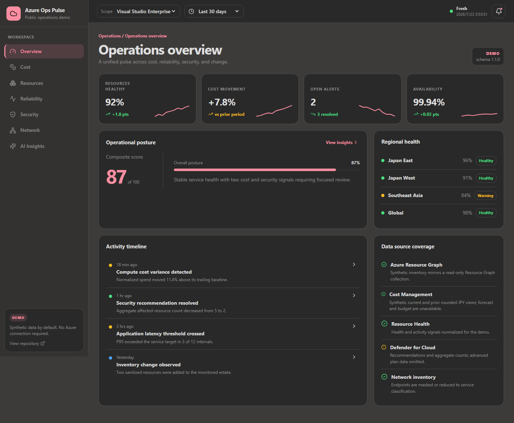
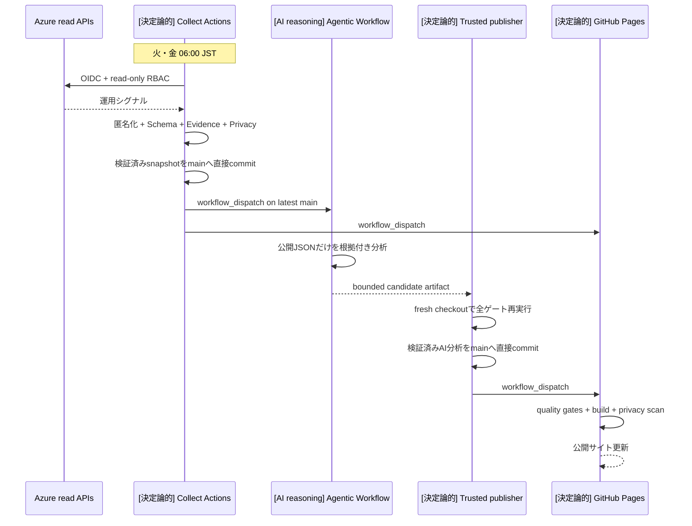

# Azure運用を、GitHub ActionsとAgentic Workflowsで自動化するデモ

Azure Ops Pulse は、Azure の公開可能な運用情報を **GitHub Actions で定期収集**し、
**GitHub Agentic Workflows で根拠付き分析**を作り、**決定論的な再検証を通してから自動で
GitHub Pages へ公開**する一連の流れを示す公開デモです。

**ライブサイト:** <https://aktsmm.github.io/azure-ops-pulse-demo/>



## 対象読者・課題・得られる価値

| 対象 | よくある課題 | このデモで確認できること |
| --- | --- | --- |
| Azure 運用担当 | Portal の確認と共有資料作成が分断される | 読み取り専用収集から公開用スナップショット作成までの自動化 |
| セキュリティ・ガバナンス担当 | AI に渡るデータと権限が見えにくい | 匿名化、Schema、Privacy、根拠、権限分離の各ゲート |
| 意思決定者 | 数値の出所と更新経路を短時間で把握しにくい | 7画面の公開ビューと、Actions実行・commit履歴で追跡できる更新プロセス |
| GitHub / Platform 担当 | 決定論的 CI と AI reasoning の境界を設計したい | Actions、Agentic Workflow、trusted publisher、Pages の責務分離 |

このサイトは Azure Portal の代替ではありません。公開可能な集計値だけを扱い、
「何が分かるか」と同時に「何が未収集か」も表示します。

## ダッシュボードの見方

- **リソース**: `VM`、`NW`、`DB`、日本語の一般名、公開 ID、タグで検索できます。
  カテゴリ・種別・リージョン・リソース グループ・Resource Health 状態を組み合わせて
  絞り込み、カテゴリ・種別・リージョン・リソース グループでまとめて表示できます。
- **ネットワーク**: VNet・サブネット・NIC・関連リソースの構成参照を相関図に表示します。
  VNet の関連範囲を選択し、ノードの直接の関連を強調表示できます。点線は参照のみの
  ノードです。線は通信経路・通信の許可・正常性を示すものではありません。
- **セキュリティ**: Defender の取得状態を項目別に表示し、Advisor の推奨事項は
  カテゴリ・影響度別に別集計します。両者の件数は合算しません。
- **コスト・AI 分析**: 未収集を 0 円・問題なしとは扱いません。コストは現在期間と
  前期間の理由コードを個別表示します。AI 分析がない場合は、生成した分析と混同しない
  ように、既存スナップショットから確認できる事実を別枠で表示します。

古い公開スナップショットには Advisor・相関図・診断理由が含まれないことがあります。
UI の更新だけでは実データは増えず、更新後の収集ワークフローを実行する必要があります。

## 何が自動か

| 工程 | 実行主体 | 現在の動作 | 公開前の境界 |
| --- | --- | --- | --- |
| Azure 収集 | GitHub Actions | 火・金 06:00（JST）と手動実行 | OIDC、読み取り専用 RBAC |
| 匿名化 | 決定論的 TypeScript | 収集プロセス内で公開表現へ変換 | 生の応答は保存・artifact化しない |
| Validation | 決定論的 TypeScript | JSON Schema、runtime schema、evidence、privacy を検証 | 失敗時は候補を公開領域へ昇格しない |
| snapshot 公開 | GitHub Actions | 検証済み差分だけを `main` へ直接commitし、AI分析とPagesを明示的に起動 | Schema、evidence、privacy の全ゲート成功 |
| AI 分析 | GitHub Agentic Workflow | 新しいsnapshotの公開後、最新 `main` で起動 | 入力は `public/data/snapshot.json` だけ |
| AI 分析公開 | trusted publisher | AI候補を再検証し、差分があれば `main` へ直接commit | Schema、Japanese、evidence、baseline、privacy の全ゲート成功 |
| Pages deploy | GitHub Actions | 検証済みの各公開commit後に build・検証・deploy | GitHub Pages environment |

**公開更新は完全自動です。** ただし、収集・匿名化・決定論的検証・AI候補の再検証の
いずれかが失敗した場合は `main` を更新せず、最後に検証済みの公開snapshotを維持します。

## イベント駆動の更新シーケンス


```mermaid
sequenceDiagram
  participant Azure as Azure read APIs
  participant Collect as [決定論的] Collect Actions
  participant Agent as [AI reasoning] Agentic Workflow
  participant Publish as [決定論的] Trusted publisher
  participant Pages as [決定論的] GitHub Pages

  Note over Collect: 火・金 06:00 JST
  Collect->>Azure: OIDC + read-only RBAC
  Azure-->>Collect: 運用シグナル
  Collect->>Collect: 匿名化 + Schema + Evidence + Privacy
  Collect->>Collect: 検証済みsnapshotをmainへ直接commit
  Collect->>Agent: workflow_dispatch on latest main
  Collect->>Pages: workflow_dispatch
  Agent->>Agent: 公開JSONだけを根拠付き分析
  Agent-->>Publish: bounded candidate artifact
  Publish->>Publish: fresh checkoutで全ゲート再実行
  Publish->>Publish: 検証済みAI分析をmainへ直接commit
  Publish->>Pages: workflow_dispatch
  Pages->>Pages: quality gates + build + privacy scan
  Pages-->>Pages: 公開サイト更新
```

従来の 06:45 JST 独立 schedule はありません。収集runがすべての決定論的ゲートを通過して
検証済みsnapshotを`main`へ直接commitした場合だけ、固定名の`ai-insights.lock.yml`と
`pages.yml`を`workflow_dispatch`します。AI候補も再検証を通過した場合だけ`main`へ直接
commitし、Pagesを明示的に再配信します。

GitHub 公式仕様では、`GITHUB_TOKEN` が発生させる多くのイベントは再帰実行を抑止しますが、
`workflow_dispatch` と `repository_dispatch` は例外として実行されます。このデモは
collectionとtrusted publisherだけに`actions: write`を付与して、Token起点の公開commit後も
AI分析とPages配信を明示的に実行します。Agentic Workflowの権限は読み取りと候補artifactの
アップロードに限定します。

## GitHub Actions workflow の役割

| Workflow | 役割 | 主な権限 |
| --- | --- | --- |
| [`collect-azure.yml`](.github/workflows/collect-azure.yml) | OIDC収集、匿名化候補の検証、snapshotの直接公開、AI/Pagesのdispatch | `id-token: write`、`contents: write`、`actions: write` |
| [`ai-insights.md`](.github/workflows/ai-insights.md) / `.lock.yml` | 公開JSONだけを読む根拠付き分析 | `contents: read`、`copilot-requests: write` |
| [`publish-ai-insights.yml`](.github/workflows/publish-ai-insights.yml) | fresh checkoutで候補を再検証しAI分析を直接公開、Pagesをdispatch | validateはread-only、publish jobだけ`contents: write`、`actions: write` |
| [`ci.yml`](.github/workflows/ci.yml) | lint、typecheck、tests、schema、build、privacy | `contents: read` |
| [`pages.yml`](.github/workflows/pages.yml) | 検証済みproduction buildをPagesへdeploy | `pages/id-token: write` |

すべての参照 Action は immutable SHA に固定しています。

## Agentic Workflow とは

GitHub Agentic Workflows（gh-aw）は、Markdown の宣言と指示から、AI coding agent を
GitHub Actions 上で実行する hardened `.lock.yml` を生成する仕組みです。このリポジトリは
`gh-aw v0.88.7` を固定し、strict compile と検証を行います。gh-aw は Public Preview
として扱い、仕様変更を前提に固定versionと生成差分をレビューします。

### AI に渡す唯一の入力

`public/data/snapshot.json` だけです。Azure、workflow secrets、logs、他artifact、
commit history、外部サービスは分析対象にしません。入力はすでに公開用匿名化境界を通過しています。

### AI ができること / できないこと

| できること | できないこと |
| --- | --- |
| 既存の数値とsource pathを使った0〜4件の日本語分析候補 | Azure APIやsecretへの接続 |
| 相関と確認事項を、限定表現で提示 | 未収集値、root cause、識別子、正確な金額の捏造 |
| `aiInsights` 配列だけを変更 | Azure remediation、auto-merge、Pagesへの直接公開 |

### safe / trusted publisher 境界

Agent job は repository write 権限を持ちません。候補は1日保持・1MiB以下・単一の
`snapshot.json` artifact に限定されます。別workflowの trusted publisher が最新
default branchをfresh checkoutし、JSON Schema、runtime schema、日本語、数値根拠、
baseline差分、privacyを再検証します。repositoryのwrite権限は検証後の公開jobだけにあります。

公開更新に毎回の人間承認は挟みません。ただし、分析が提案する運用上の優先度や
対処の妥当性は人間が判断し、Azureへの変更を自動実行することはありません。

## セットアップ

### 1. Azure OIDC と RBAC

Microsoft Entra application または user-assigned managed identity に GitHub Actions 用の
federated identity credential を設定し、次の repository secrets を登録します。

| Secret | 用途 |
| --- | --- |
| `AZURE_CLIENT_ID` | application / managed identity の client ID |
| `AZURE_TENANT_ID` | tenant ID |
| `AZURE_SUBSCRIPTION_ID` | 対象subscription ID |

workflow が OIDC token を取得するため `id-token: write` が必要です。RBAC は有効化する
sourceに必要な最小read roleから始めます。例は subscriptionの `Reader`、
cost用の `Cost Management Reader`、組織承認済みのDefender read roleです。

#### 任意データの収集結果と診断

`collect-azure.ts` は任意ソースの失敗を、認証・読み取り拒否・要求数制限・
請求スコープ/契約種別・非対応API・応答形式不正・原因不明の定型文に分類します。
CLI の stderr、例外本文、トークン、請求識別子は公開しません。
分類は応答に基づくもので、アクセス権や契約状態を推測して断定するものではありません。

UIの診断表示には `sources[].reason?` の固定コードを使用し、`.message` をそのまま描画しません。
コードは `authentication | forbidden | throttled | billing-scope | unsupported |
invalid-response | unknown | empty | unsupported-columns | currency-mismatch |
invalid-rows | partial-collection | not-collected` のみです。
後方互換な任意フィールド `cost.periodDiagnostics?` は
`{ current: { availability, reason? }, previous: { availability, reason? } }` で、
期間ごとの `availability` は `available | unavailable`、公開金額の状態と一致します。
利用不可の期間は原因コードを必須とし、成功した期間ではコードを省略します。
例えば現在が取得済みで前期間だけ読み取り拒否の場合、前期間に `forbidden` を保持し、
現在の金額を非表示にしません。古いスナップショットでコードがない場合は原因未特定として扱い、
自由文から原因を推測して確定しません。

- **Cost Management**: 現在/前期間を独立して取得します。空の成功応答は費用ゼロではなく未取得です。
  API は既存の `2025-03-01` を維持し、ページ継続の完了・列順・全行の JPY と有限の金額を
  検証します。通貨混在/欠落、未知の列、壊れた金額、不完全なページでは総額を公開しません。
  為替換算は行わず、従来の概算表示・少額非開示・比較値の制限を維持します。
- **Defender for Cloud**: 評価、セキュア スコア、アクティブなアラートを独立して読み取ります。
  成功した空の評価/ゼロアラートと読み取りエラーを区別し、空の結果からプラン無効を推定しません。
  一部失敗時も読めたフィールドだけ公開します。セキュア スコアを規制コンプライアンスの
  達成率として流用しません。
- **Azure Advisor**: `AdvisorResources` のカテゴリ・影響度別件数のみを公開します。
  推奨タイトル、対象名/ID、削減見込額は取得結果に追加せず、未知の分類は
  `Other` / `Unknown` に集約します。成功して0件だった結果は読み取り失敗と区別します。
- **Network topology**: ARG の構成プロパティに明示された参照だけを使用します。
  VNet/サブネット、NIC/VM、Private Endpoint、ピアリング、NSG、ルートテーブル、
  NAT Gateway、Load Balancer/Application Gateway のフロントエンド/バックエンド参照を対象にします。
  グループ/リージョン一致やARMパスの類似から線を生成しません。
  ルート規則、IP/FQDNだけのバックエンド、NSGの許可判定、通信経路/正常性は収集対象外です。
  一部のネットワーク製品や構成参照は未対応であり、Azure 全体の完全な接続図ではありません。
  公開上限は400ノード/800辺で、重複を除去し、欠けた端点への辺は公開しません。
  上限による省略、未取得の構成、参照だけの端点がある場合は `partial` です。

これらは公開スキーマ **1.4.0 の後方互換な任意フィールド**です。
古いスナップショットでフィールドがない場合は「未収集」であり、「正常」「0件」ではありません。

```text
advisor?: {
  availability, message,
  recommendations: [{ category, impact, count }]
}
network.topology?: {
  availability, message, truncated,
  nodes: [{ id, type, region?, referenceOnly, scope }],
  edges: [{ source, target, kind }]
}
security.fieldAvailability?: { secureScore, assessments, activeAlerts }
```

`availability` は `available | partial | unavailable`、
Advisor の `category` は `Cost | HighAvailability | Performance | Security |
OperationalExcellence | Other`、`impact` は `High | Medium | Low | Unknown` です。
トポロジーの `scope` は `inventory | external | uncollected`。
`inventory` はインベントリまたは埋め込み構成で存在を確認できたノードを指します。
同一スコープで参照しか取得できない端点は `uncollected`、別サブスクリプションの参照は
`external` とし、いずれも `referenceOnly: true`、未取得リージョンは省略します。
ID は既存インベントリと同じ `res-<stableHash>` で、ARM参照は大文字小文字を無視して照合します。
生のARM ID/名前/構成はメモリ内だけに保ち、JSONには書き出しません。
辺の `kind` は `contains | subnet | virtual-machine | peering | network-security-group |
route-table | nat-gateway | backend | frontend | public-ip | private-link` です。
ZodとJSON Schemaは未知フィールドを拒否し、Zodは端点整合・重複・ソース状態も検証します。
AIの数値根拠は引き続き実在する値と利用可能なソースを必須とし、
Advisorの件数は `advisor.recommendations.<index>.count` を参照できます。

再収集には既存の認証情報、対象スコープの読み取り権限、利用可能な請求データが必要です。
この拡張は Azure への書き込み、Defenderプランの有効化、ロール付与、課金設定変更を行いません。
日本リージョン固有の提供可否を推定せず、選択したサブスクリプションから実際に読めた構成のみを扱います。

公式根拠（日本語URL、2026-09-09確認）:

- [ARG のカテゴリ別クエリ（Advisor・ネットワーク）](https://learn.microsoft.com/ja-jp/azure/governance/resource-graph/samples/samples-by-category)
- [Defender for Cloud の ARG クエリ](https://learn.microsoft.com/ja-jp/azure/defender-for-cloud/resource-graph-samples)
- [Cost Management Query API 2025-03-01](https://learn.microsoft.com/ja-jp/rest/api/cost-management/query/usage?view=rest-cost-management-2025-03-01)

### 2. GitHub repository

1. 収集・trusted publisherの公開jobが、検証済み差分をdefault branchへpushできるようにします。
2. **Settings → Pages** でsourceに **GitHub Actions** を選びます。
3. コード変更のPRにはCI成功と人間レビューを要求し、検証済みデータの自動公開経路とは分離します。
4. Agentic Workflowを使うorganizationでは、Copilot billing/policyを確認します。

### 3. gh-aw Preview prerequisites

GitHub CLI、Node.js 22、GitHub Copilotを利用できるorganization設定が必要です。
このリポジトリのcompile scriptは固定release binaryをchecksum検証して使うため、
global extensionのversionを変更しません。

```bash
npm run compile:ai-insights
gh aw validate ai-insights --strict --no-check-update
```

手動実行は `workflow_dispatch` を維持しているため、Actions画面または
`gh aw run ai-insights --ref main` を使えます。

## ローカル実行

要件: Node.js 22、npm 10 以降。

```bash
npm ci --ignore-scripts
npm run dev
```

開発用の合成データが必要な場合だけ次を実行します。

```bash
npm run generate:demo    # .candidate/demo-snapshot.json に出力（公開ファイルは触りません）
npm run preview:demo     # 公開ファイルを DEMO で上書きし、ローカル画面で確認する場合のみ
```

現在commitされているsnapshotは `mode: AZURE` です。synthetic generatorはAzure未接続時の
UI開発・schema検証用fallbackであり、現在データの出所を表すものではありません。
`preview:demo` で上書きしたまま commit しても、`npm test` の公開snapshot契約チェックが
PRとPagesデプロイの両方で止めます。

## 品質Gate

```bash
npm run lint
npm run typecheck
npm test
npm run validate:data
npm run scan:privacy -- public
npm run build
npm run scan:privacy -- dist
npm run compile:ai-insights
gh aw validate ai-insights --strict --no-check-update
actionlint
```

CI、Pages、Azure候補、AI候補のすべてでprivacy gateを実行します。production buildは
`dist/` に出力され、GitHub Pagesのbase pathとsnapshot同梱も検証します。

## 匿名化と公開データ契約

| データ | 公開表現 |
| --- | --- |
| subscription / tenant GUID | 先頭8桁と末尾8桁を残し、中間をmask |
| resource name | `<type末尾>-<stable hash8>` のdeterministic pseudonym。prefixは同じrecordで公開済みの `type` から導出し、Azure上の名前は一切入力にしない |
| resource group | `rg-<stable hash8>` のdeterministic pseudonym。同じresource groupのresourceは同じaliasを共有するので、所属関係は保ったまま名前だけを落とす |
| IPv4 / IPv6 | 利用可能なendpointにならない形へmask。IPv6は8 hextetに展開してから先頭2つだけを公開するので、先頭の `::` 圧縮でhost bitが前に出ることはない |
| URL / FQDN | service / provider分類だけ |
| user / email | deterministic identity alias |
| tags | `environment`、`team`、`workload`、`criticality` のallowlist |
| Defender | 集計件数と、識別子を含まないrecommendation titleだけ |
| Cost | 前期間比と丸めた概算JPY labelだけ |
| Network | inventoryとflow telemetryを分離し、inventoryからhealthを推定しない |

匿名化境界が連続して出力する16進は最大8桁（alias suffix、およびGUIDの先頭 / 末尾）です。
そのためprivacy gateは9桁以上の16進連続を`recoverable hex fragment`として拒否します。
公開JSONはparseした文字列だけを走査するので、bare numberと識別子を取り違えません。
parseできない `.json` はgateが内容を保証できないため、raw scanに緩めずそのまま失敗させます。
resource nameを部分開示していた頃は、Azureが自動生成する名前
（`DefaultWorkspace-<subscriptionId>-<region>` など）にsubscription GUIDの断片が埋め込まれ、
完全形GUIDだけを見ていたgateをすり抜けていました。

Defenderのrecommendation titleは、収集側がAzureから受け取る唯一の「人が書いた自由文」です。
運用者は`PUT /subscriptions/{id}/providers/Microsoft.Security/assessmentMetadata/{key}`で
custom assessmentを作成でき、そこでは`displayName`も`assessmentType`も呼び出し側が指定する
リクエストフィールドで、`assessmentType`には`BuiltIn`も指定できます
（[Create In Subscription](https://learn.microsoft.com/rest/api/defenderforcloud/assessments-metadata/create-in-subscription)）。
つまりレスポンスのどのフィールドでも著作者を証明できません。
snapshotのどこにも現れないproject名や人名はマスク側から認識できないため、
**収集側はAzure由来のtitleを一切公開しません**。
推奨事項は個別の行として残しつつ、titleはリポジトリ内の定型文＋連番に置き換えます
（`Defender の推奨事項（タイトル非公開） #1`）。
これにより公開される文字列の集合はリポジトリ内の定数だけに閉じます。
Microsoft組み込みのtitleを復活させるには、レビュー済みの文字列カタログをリポジトリに持ち
APIの戻り値ではなくカタログ側の文字列を公開する必要があり、継続的な保守コストを伴うため
リポジトリ所有者の判断に委ねています。
公開境界のsanitizerには従来のdenylist（title内にresource名 / resource group名 / identity /
subscription / tenant GUID / 9桁以上の16進が含まれないことの確認）を残していますが、
これはDEMOとfixture経路のためのbackstopであり、主たる制御ではありません。
それ以外の自由文はすべて収集側が件数から組み立てる集計文であり、Azure由来の文字列を含みません。

aliasの`stableHash`は鍵を持たない32-bit FNV-1aなので、正確にはirreversibleではなく
deterministic pseudonymです。名前そのものは公開値から復元できませんが、
候補の名前を推測できる相手（Azureの命名規約は推測しやすい）はhashを再計算して
オフラインで一致を確認できます。aliasは「名前を知らない相手に名前を教えない」ための境界であって、
「所属の証明不可能性」ではありません。これを閉じるには公開できないkeyを使ったHMACが必要で、
公開saltでは意味がありません。同じ制約は既存の `res-` / `identity-` にも当てはまります。

privacy gateは既知の漏洩パターンを拒否する仕組みであって、任意のテキストを安全にする仕組みでは
ありません。Azure由来の自由文はscanに頼らず、上記のようにallowlistまたは定型ラベルで扱います。

現在の正本は [`schemas/public/v1.4`](schemas/public/v1.4) と
`schemaVersion: 1.4.0` です。`schemas/public/v1` はimmutableな1.1 compatibility alias、
`schemas/public/v1.1` / `schemas/public/v1.2` / `schemas/public/v1.3` はその明示version pathです。
nullable値は「未収集 / 未評価」を表し、根拠のある数値 `0` と区別します。

1.4.0 では `inventory.resources[].name` / `resourceGroup` をdeterministic pseudonymに限定します。
1.3 で有効だった部分開示の値は1.4では拒否されるため、version pathを分けています。

1.3.0 では Resource Health の適用範囲を明示するため、resource statusに `NotApplicable`
（Resource Healthがそもそも評価しない種別＝対象外）を追加し、`Unknown`（対応種別だが状態を
取得できなかった＝未評価）と区別します。あわせて `reliability.coverage`、
`reliability.serviceHealth`、`network.metricCoverage` を追加し、source availabilityが
`available` なのに評価件数が `0` といった矛盾はschema違反として拒否します。

raw Azure response、完全なID、名前、address、正確なcost、token、secretはcommit、
artifact、log、AI入力に含めません。

## 制約

- 公開ビューは意図的に情報を削減しており、Azure Portalやprivate observabilityを置き換えません。
- source availabilityはprovider registration、subscription種別、RBAC、plan、retentionに依存します。
- Cost forecast、budget、network flow healthはauthoritative sourceがない限り推定しません。
- static siteは最後に検証済みのsnapshotを表示し、72時間超をUIで期限超過として扱います。
- AI出力は助言であり、root causeの確定やAzure変更を行いません。

## FAQ / トラブルシュート

### 収集に失敗したら公開データは消えますか

消えません。候補の生成・検証に失敗したrunは`main`を更新せず、最後に検証済みのsnapshotを維持します。

### snapshotが公開されてもAIが起動しません

`collect-azure.yml`の「Dispatch AI analysis and Pages deployment」stepを確認してください。
Actions設定でworkflow実行と`actions: write`が許可されているかも確認します。

### AI分析も自動で公開されますか

はい。trusted publisherは、候補artifactをfresh checkoutで再検証した後だけ`main`へ直接commitします。

### Pagesが更新されません

Pages sourceがGitHub Actionsになっていること、`pages.yml`のquality gate、`github-pages`
environment、base path検証を確認してください。

### Azureに接続せずUIを開けますか

可能です。`npm run generate:demo` は開発用fallbackを生成します。公開snapshotのmodeとは明確に分離されます。

## 公式リファレンス

- Azure Login with OIDC:
  <https://learn.microsoft.com/azure/developer/github/connect-from-azure-openid-connect>
- Azure Monitor operational excellence:
  <https://learn.microsoft.com/azure/azure-monitor/fundamentals/best-practices-operation>
- GitHub Actionsからworkflowを起動する際の`GITHUB_TOKEN`例外:
  <https://docs.github.com/actions/how-tos/write-workflows/choose-when-workflows-run/trigger-a-workflow>
- GitHub Pages custom workflow:
  <https://docs.github.com/pages/getting-started-with-github-pages/using-custom-workflows-with-github-pages>
- GitHub Agentic Workflows - creating workflows:
  <https://github.github.com/gh-aw/setup/creating-workflows/>
- GitHub Agentic Workflows - security architecture:
  <https://github.github.com/gh-aw/introduction/architecture/>
- GitHub Agentic Workflows - safe outputs:
  <https://github.github.com/gh-aw/reference/safe-outputs/>
- gh-aw v0.88.7 release:
  <https://github.com/github/gh-aw/releases/tag/v0.88.7>

## License

[MIT](LICENSE)
